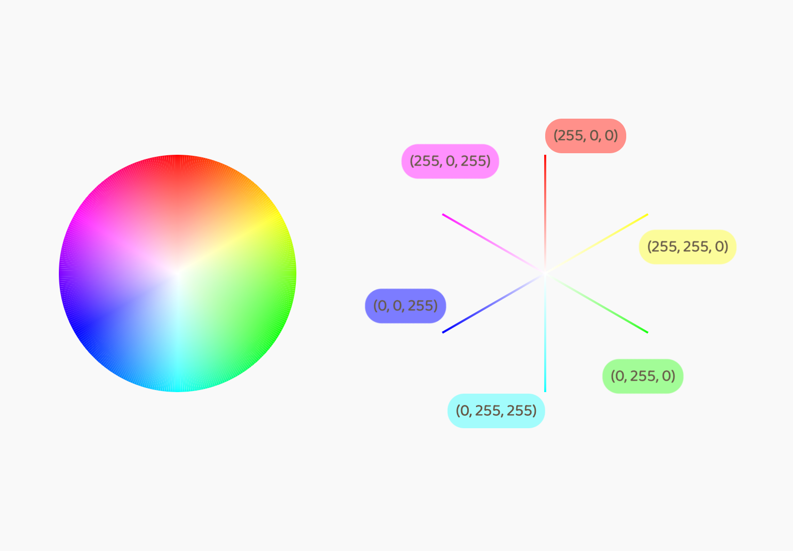
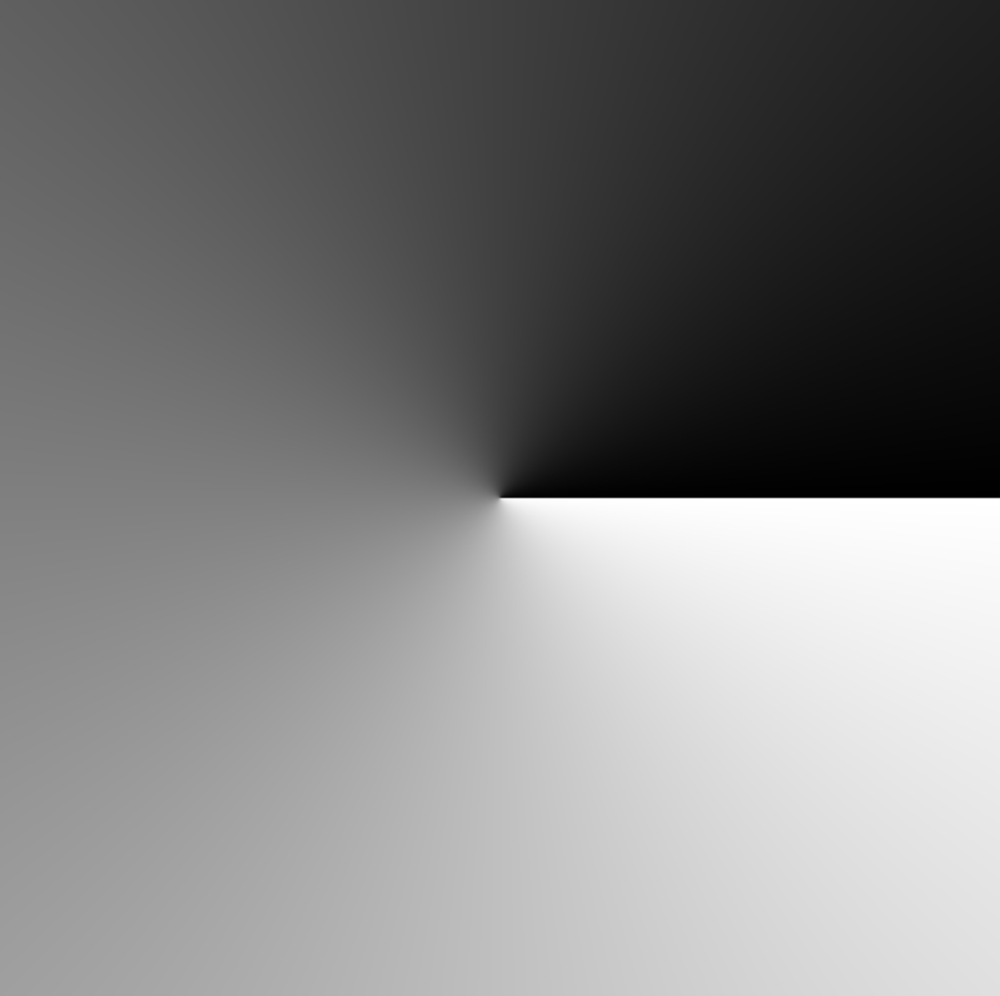
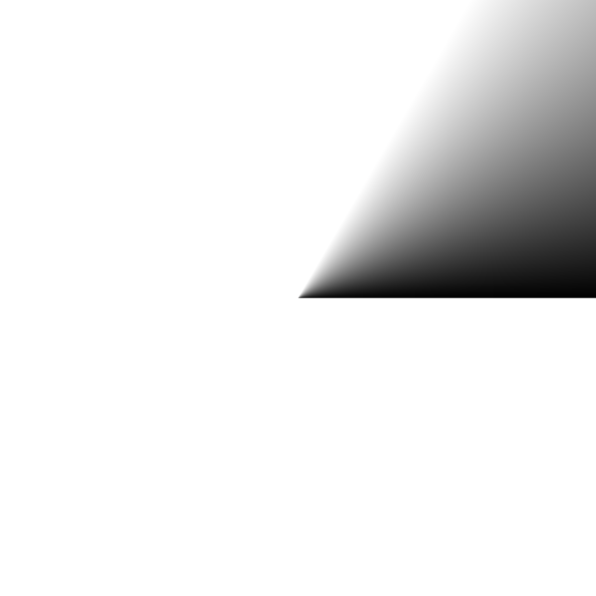
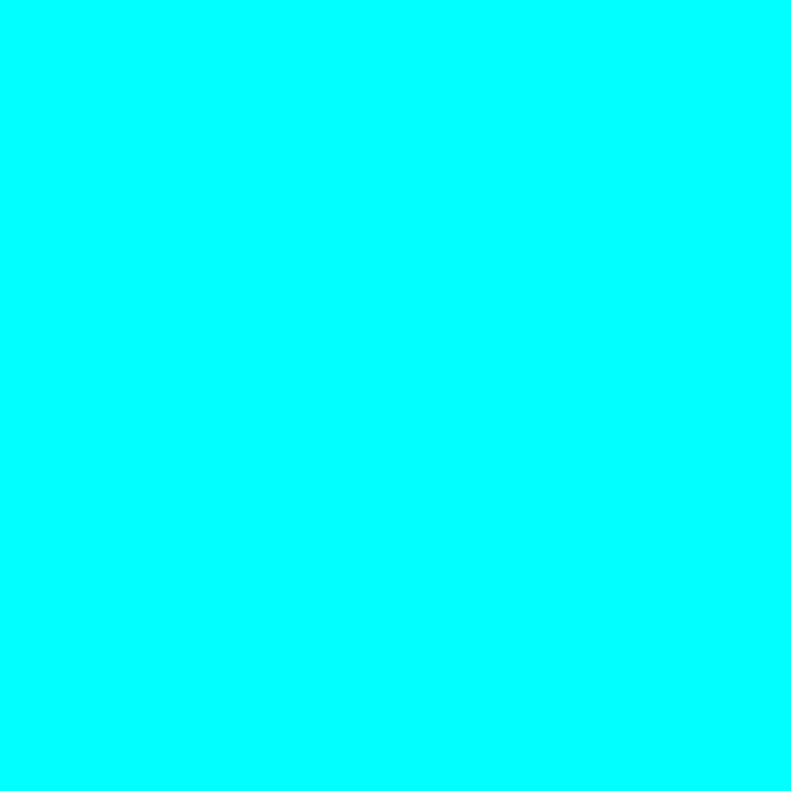
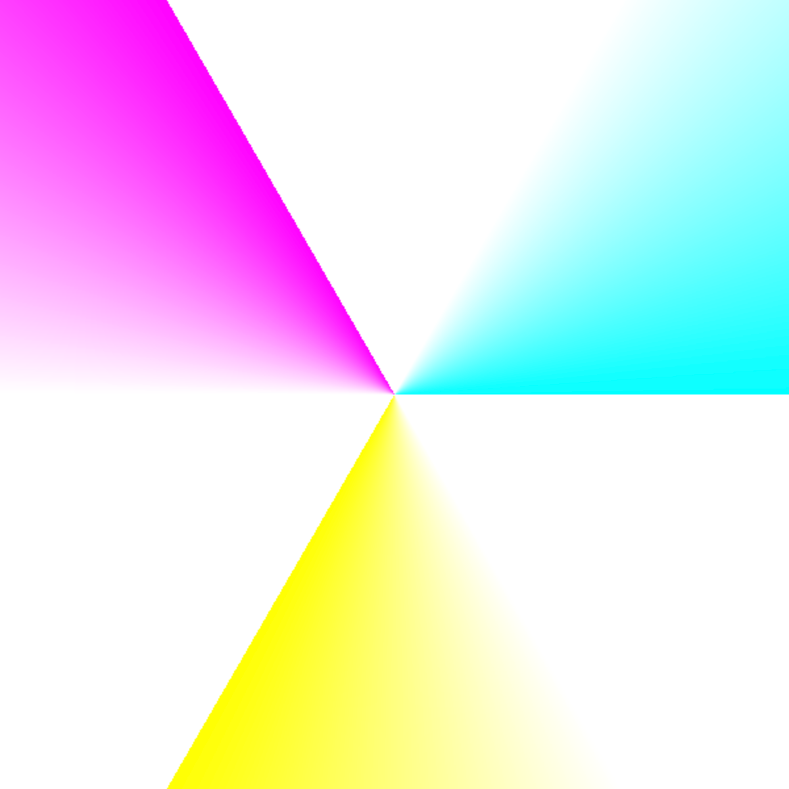
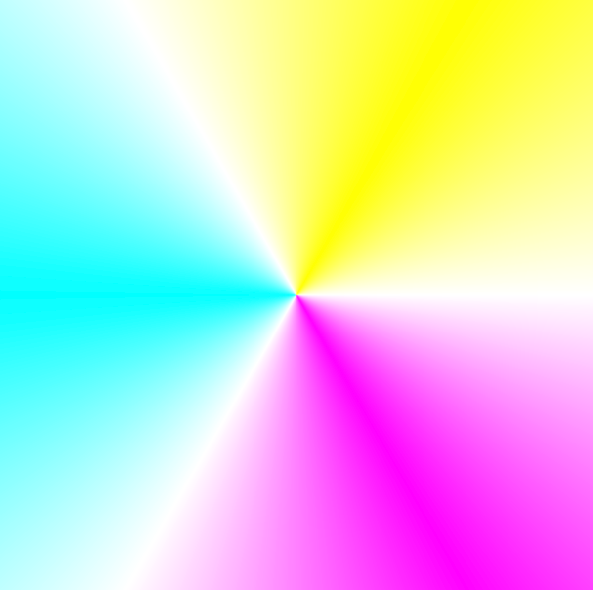
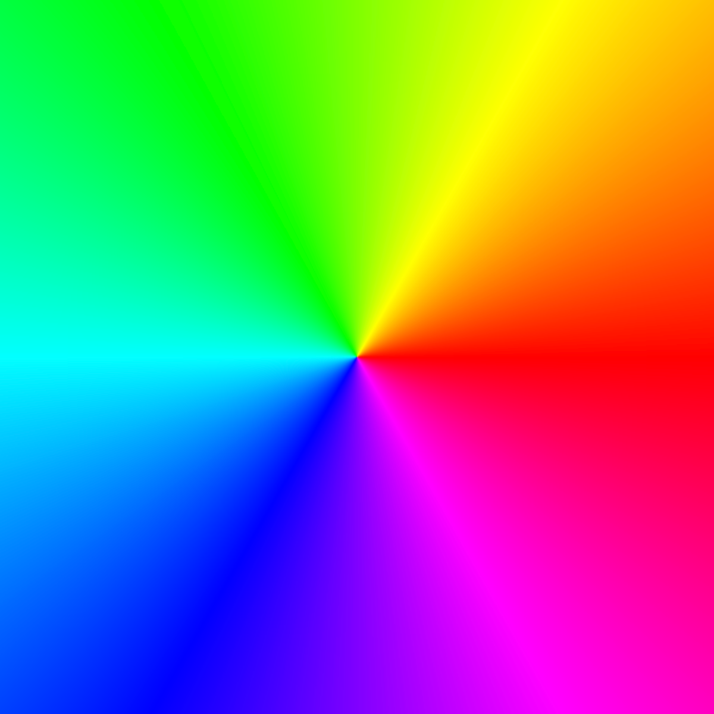
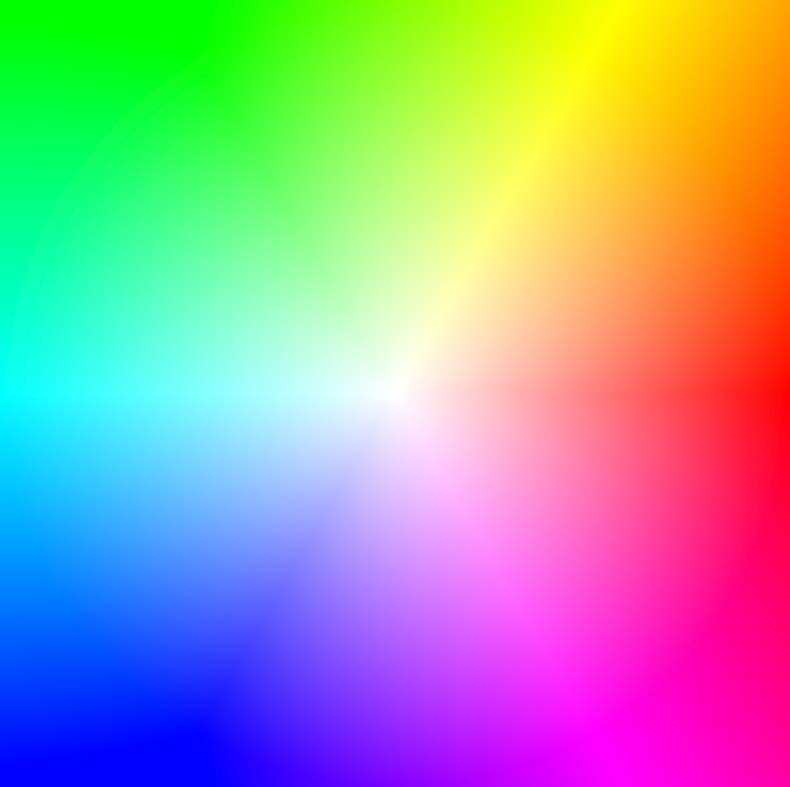

## hsv2rgbのロジックを追う



### vec3(color.x)

```glsl
vec3 hsv2rgb(vec3 color) {
  return vec3(color.x);
}
```

- r = g = b であることから、RedもGreenもBlueも均等に混ざり合って、グレースケールになる。



### vec3(color.x * 0.6)

```glsl
vec3 hsv2rgb(vec3 color) {
  // Hueを[0, 1]から[0, 6]へスケール
  float hue = color.x * 6.0;
  
  return vec3(hue);
}
```

- 原点から60°分色がつく。




### vec3(0.0, 4.0, 2.0)

```glsl
vec3 hsv2rgb(vec3 color) {
  // Hueを[0, 1]から[0, 6]へスケール
  float hue = color.x * 6.0;
  
  return vec3(0.0, 4.0, 2.0);
}
```

- 色は(0.0, 4.0, 2.0) = (0.0, 1.0, 1.0) = (0, 255, 255)



### hue + vec3(0.0, 4.0, 2.0)

```glsl
vec3 hsv2rgb(vec3 color) {
  // Hueを[0, 1]から[0, 6]へスケール
  float hue = color.x * 6.0;
  
  return hue + vec3(0.0, 4.0, 2.0);
}
```


### mod(hue + vec3(0.0, 4.0, 2.0), 6.0)

```glsl
vec3 hsv2rgb(vec3 color) {
  // Hueを[0, 1]から[0, 6]へスケール
  float hue = color.x * 6.0;
  
  vec3 m = mod(hue + vec3(0.0, 4.0, 2.0), 6.0);
  
  return m;
}
```

- water  (0, 255, 255) ... hueが0の場合、m = (0.0, 4.0, 2.0)
- pink   (255, 0, 255) ... hueが2の場合、m = (2.0, 0.0, 4.0)
- yellow (255, 255, 0) ... hueが4の場合、m = (4.0, 2.0, 0.0)



### abs(mod(hue + vec3(0.0, 4.0, 2.0), 6.0) - 3.0)

```glsl
vec3 hsv2rgb(vec3 color) {
  // Hueを[0, 1]から[0, 6]へスケール
  float hue = color.x * 6.0;
  
  vec3 m = mod(hue + vec3(0.0, 4.0, 2.0), 6.0);
  vec3 a = abs(m - 3.0);
  
  return a;
}
```

- hue = 0 の場合
  - a = abs(-3.0, 1.0, -1.0) = (3.0, 1.0, 1.0) = white
- hue = 2 の場合
  - a = abs(-1.0, -3.0, 1.0) = (1.0, 3.0, 1.0) = white
- hue = 4 の場合
  - a = abs(1.0, -1.0, -3.0) = (1.0, 1.0, 3.0) = white



### abs(mod(hue + vec3(0.0, 4.0, 2.0), 6.0) - 3.0) - 1.0

```glsl
vec3 hsv2rgb(vec3 color) {
  // Hueを[0, 1]から[0, 6]へスケール
  float hue = color.x * 6.0;
  
  vec3 m = mod(hue + vec3(0.0, 4.0, 2.0), 6.0);
  vec3 a = abs(m - 3.0);
  
  return a - 1.0;
}
```

- hue = 0 の場合
  - a - 1.0 = (3.0, 1.0, 1.0) - 1.0 = (2.0, 0.0, 0.0) = red
- hue = 2 の場合
  - a - 1.0 = (1.0, 3.0, 1.0) - 1.0 = (0.0, 2.0, 0.0) = green
- hue = 4 の場合
  - a - 1.0 = (1.0, 1.0, 3.0) - 1.0 = (0.0, 0.0, 2.0) = blue



### clamp(abs(mod(hue + vec3(0.0, 4.0, 2.0), 6.0) - 3.0) - 1.0, 0.0, 1.0)

```glsl
vec3 hsv2rgb(vec3 color) {
  // Hueを[0, 1]から[0, 6]へスケール
  float hue = color.x * 6.0;
  
  vec3 m = mod(hue + vec3(0.0, 4.0, 2.0), 6.0);
  vec3 a = abs(m - 3.0);
  vec3 rgb = clamp(a - 1.0, 0.0, 1.0);
  
  return rgb;
}
```

見た目は変わらず。

- hue = 0 の場合 (1.0, 0.0, 0.0) = red
- hue = 2 の場合 (0.0, 1.0, 0.0) = green
- hue = 4 の場合 (0.0, 0.0, 1.0) = blue

### mix(vec3(1.0), rgb, color.y)

```glsl
vec3 hsv2rgb(vec3 color) {
  // Hueを[0, 1]から[0, 6]へスケール
  float hue = color.x * 6.0;
  
  vec3 m = mod(hue + vec3(0.0, 4.0, 2.0), 6.0);
  vec3 a = abs(m - 3.0);
  vec3 rgb = clamp(a - 1.0, 0.0, 1.0);
  
  // 白とrgbを彩度（動径）に沿って補間
  return mix(vec3(1.0), rgb, color.y);
}
```

- color.y は彩度s = 円錐の半径



### color.z * mix(vec3(1.0), rgb, color.y)

```glsl
vec3 hsv2rgb(vec3 color) {
  // Hueを[0, 1]から[0, 6]へスケール
  float hue = color.x * 6.0;
  
  vec3 m = mod(hue + vec3(0.0, 4.0, 2.0), 6.0);
  vec3 a = abs(m - 3.0);
  vec3 rgb = clamp(a - 1.0, 0.0, 1.0);
    
  // 白とrgbを彩度（動径）に沿って補間したものに明度をかける
  return color.z * mix(vec3(1.0), rgb, color.y);
}
```


### 参考

- [HSB(HSV)からif文を使わずにRGBへ変換する](https://sites.google.com/site/bknobiboroku/programming-tips/wpf/Csharp_wpf_HSB_to_RGB)
- [RGB -> HSV 変換式を中学数学でガチ導出する](https://zenn.dev/tetracalibers/articles/78474ee3e8678e)